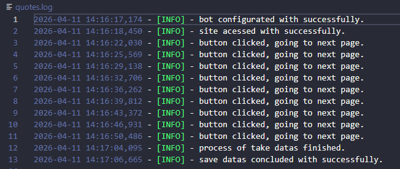
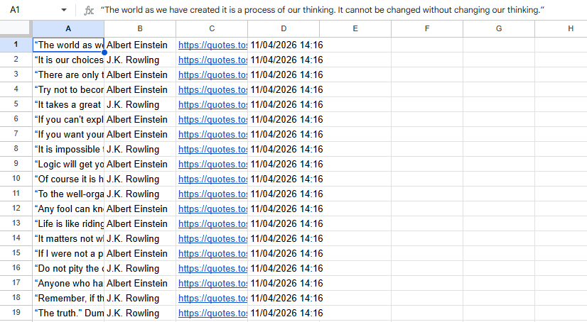
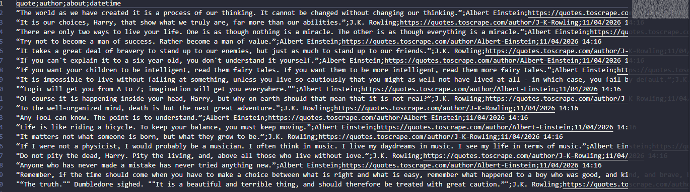
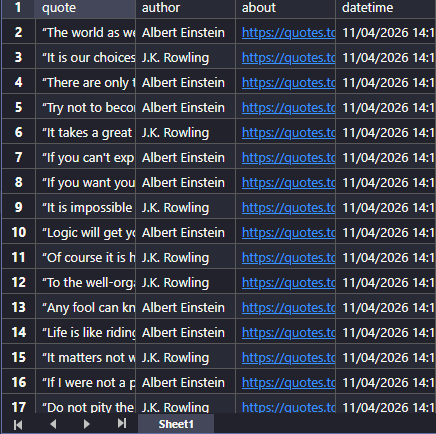

##  🌟 Quotes Web Scraper | Pythonic Effort 

  robust and automated web scraping built with __Python__ and __Selenium__. the script extracts data from quotes.toscrape.com and persists collected data to multiple professional formats.

##  🛠️ Features

  * __Automated data extraction__: extract the author's name, quote, link to see about the author and the datetime of the extraction.
  * __filter of author__: this script persists the quotes of the authors that are in the filter of the file config.json, can be changed to other authors but need to put capital letter in begginning of the name and surname.
    __example__: the filter "authors": ["Albert Einstein", "J.K. Rowling" ] does the code just take quotes of Albert Einstein and J.K. Rowling.
  * __anti-bot detection__: integrated with Selenium-Stealth and Options to avoid detection.
  * __logging library__: integrated with comprehensive logging for real-time monitoring and error tracking.
  * __error handling__: uses blocks of try and except to try again if an error happens and be robust.
  * __multi-format persistence__:
    *__local__: save data to .csv and .xlsx files.
    *__cloud__: syncs data to _google sheets_ spreadsheets.

## 🛠️ Choice of Tools: Why Selenium?

Although this specific website has a static structure that could be handled by lighter libraries like BeautifulSoup, I deliberately chose to use **Selenium WebDriver** for this project to demonstrate the following technical competencies:

* **Browser Automation:** Proficiency in configuring and managing WebDrivers (Chrome/Firefox).
* **User Interaction:** Ability to simulate human-like behavior, such as clicking, scrolling, and handling dynamic elements.
* **Scalability:** Preparing the codebase for more complex scenarios where JavaScript rendering, login authentication, or AJAX calls would be required.
* **Advanced Logic:** Implementing explicit and implicit waits to ensure script stability regardless of network latency.

This project serves as a demonstration of my ability to navigate and automate web environments beyond simple HTTP requests.

## 📊 result and performance

  ### Execution logs
  

  ### data output (Google sheets, CSV and XLSX)
  
  
  

## 📋 setup and prerequisites

  __google sheets integration__: to the script storage the data correctly, follow these steps:
     __open file__: open a new planner in google sheets and rename it as "Planner quotes".
     __share acess__: copy your adress of client_email from creds.json and share with it.

  __rename__:
    rename creds_example.json to creds.json.
    edit your filter of authors in config.json to the authors that you want take quotes.

  __installation__:
    you must install the librarys inside requirements.txt in your terminal, for this you can put this:
      `pip install -r requirements.txt`

## ⚙️ excepcional structure of the script:

  __security and credibility__: the sensitive data are protected by .gitignore
  __code structure and documentation__: clean code structure using OOP and professional documentation
  __global engineering__: use international standards of software engineering.

I hope you like it! Focusing on be better each day!⭐
_Pythonic Effort_
  
    
  
    
